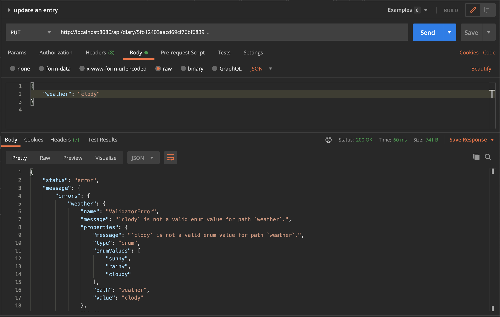
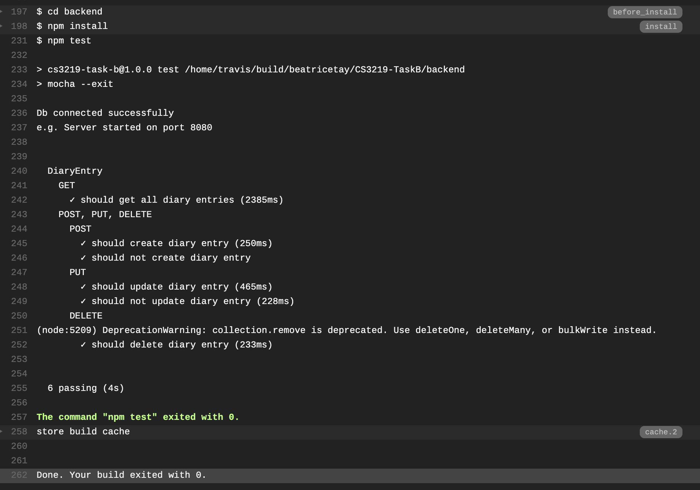
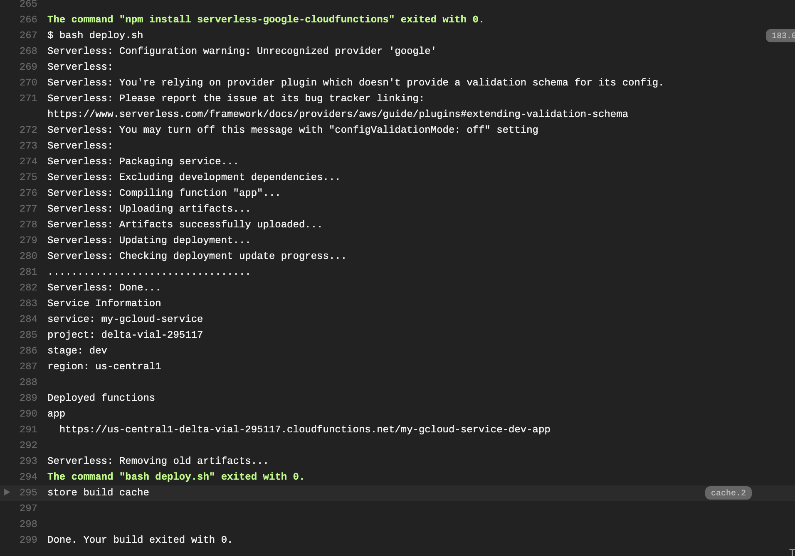
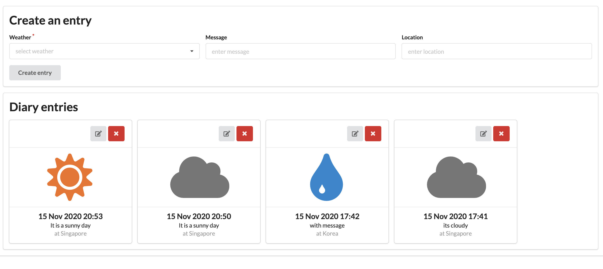

<h1>CS3219 Task B</h1>
A weather diary created using MongoDB and React.

<h2>Task B1</h2>

Method | Route | Behavior
--- | --- | ---
POST | /api/diary | Create a new diary entry
GET | /api/diary | Retrieves all diary entries
PUT | /api/diary/:entry_id | Update a diary entry
DELETE | /api/diary/:entry_id | Delete a diary entry

The default port configuration is 8080.

<h3>Running API calls locally</h3>

1. Run `cd backend`
2. Run `npm install`
3. Run `npm start`
4. Test API methods using Postman to localhost:8080

Example:

<h3>Running API calls to deployed endpoints</h3>

1. Test API methods using Postman to https://us-central1-delta-vial-295117.cloudfunctions.net/my-gcloud-service-dev-app 

<h2>Task B2</h2>
Implemented tests using Mocha and Chai, and used Travis CI to automate testing.

<h3>Running tests locally</h3>

1. Run `cd backend`
1. Run `npm install`
2. Run `npm test`

<h3>Running tests via Travis CI</h3>

Travis CI Build history can be accessed via https://travis-ci.com/github/beatricetay/CS3219-TaskB/builds 

<h2>Task B3</h2>
Serverless deployment using Google cloud function and Travis CI.

The application is deployed to https://us-central1-delta-vial-295117.cloudfunctions.net/my-gcloud-service-dev-app.

Travis CI Build history can be accessed via https://travis-ci.com/github/beatricetay/CS3219-TaskB/builds 

The deployed endpoint can be tested using the API described in Task B1.

<h2>Task B4</h2>
Built frontend using React

<h3>Running frontend</h3>

1. Run `cd frontend`
2. Run `npm install`
3. Run `npm start`
4. Visit `localhost:3000` to interact with the website and test the CRUD operations

